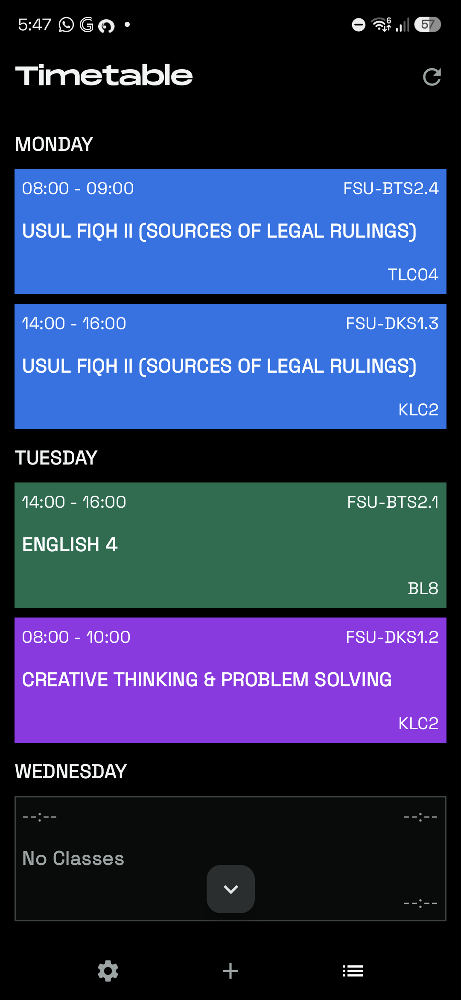
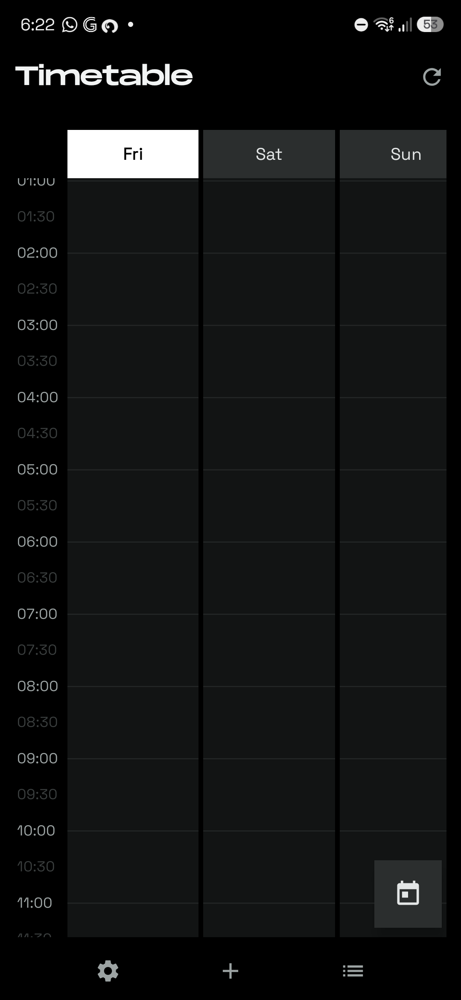
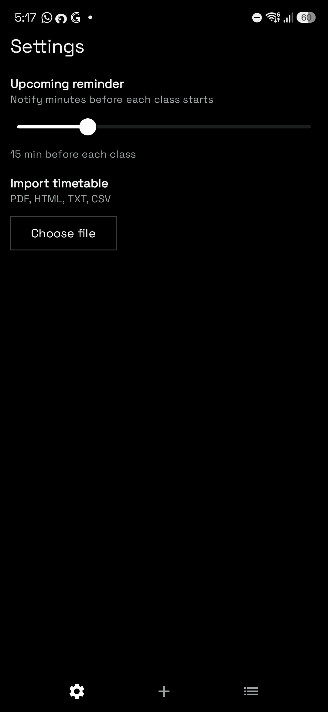

# Monosched

A monochrome weekly timetable for Android. Table-first UI, full 24-hour grid,
file import, class reminders, and two home-screen widgets. Jetpack Compose,
single `timetable.json` store, no database, no accounts.

| Table | Grid | Settings |
|---|---|---|
|  |  |  |

## Features

- **Table view** — the main page: one section per day, color cards with
  time · venue, bold subject, group. Today rides a white tab.
- **Grid view** — 01:00–24:30, sticky day header + time gutter, overnight
  spill, live `---<HH:MM>---` now-line on today's column.
- **Import** — PDF (line text and column-grid printouts), HTML, TXT, CSV;
  shared or opened files import straight in. First launch offers a bare
  welcome page with import.
- **Reminders** — heads-up N minutes before each class (slider, 1–60) plus a
  starting-now ping; exact alarms, boot-proof, stale-proof.
- **Widgets** — scrollable full-week timetable (today wears the white chip,
  live class stays white while the rest mute grey) and a current-class card
  (`• Started` green, `• Upcoming N min` inside the reminder lead).
- **Monument headers** — display face on the title bar and welcome screen.

## Build

```sh
./gradlew :app:assembleDebug
adb install -r app/build/outputs/apk/debug/app-debug.apk
```

Requires Android 8+ (minSdk 26). No extra setup; the Gradle wrapper is in `gradle/`.

## Layout

```
app/src/main/java/com/example/timetableapp/
  ui/screen/        TimetableScreen.kt (table/grid/welcome/settings),
                    SessionDetail.kt (sheet + edit dialogs)
  ui/viewmodel/     TimetableViewModel.kt
  ui/theme/         black/grey/white scheme + Monument face
  data/parser/      line-regex, lenient token, and positioned-grid PDF import
  data/repository/  JSON file store (single lock, sync snapshots)
  notifications/    exact-alarm scheduler + boot/alarm receiver
  widget/           week collection widget + current-class widget
```

The `kb/` module is a separate Arabic-keyboard app sharing this tree; it is
not part of Monosched.

## Notes

- Bundled Monument Extended is licensed *free for personal use* — a
  commercial license is needed before any store release.
- Storage permissions in the manifest are historical; all file access goes
  through the system picker and share intents.
